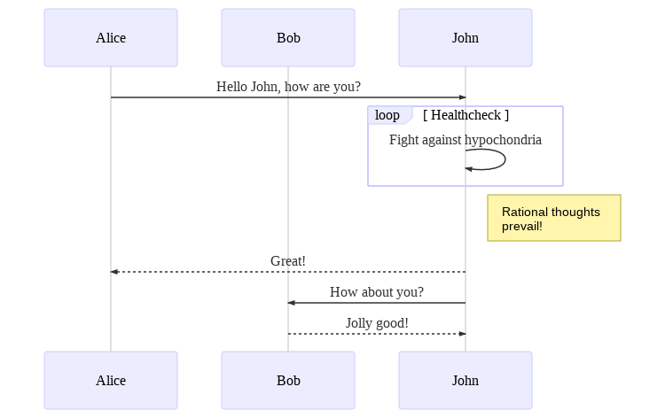
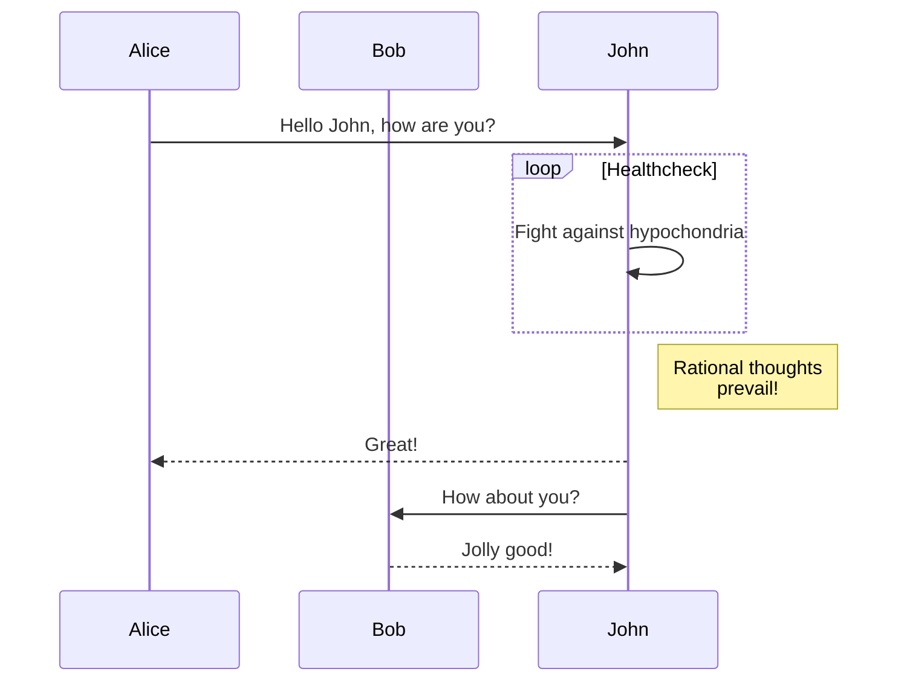
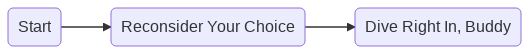
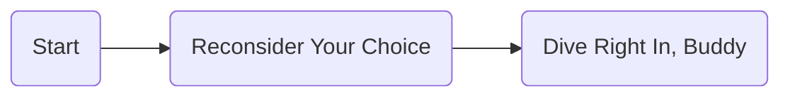

# mermaid-test

```mermaid
sequenceDiagram
    participant Alice
    participant Bob
    Alice->>John: Hello John, how are you?
    loop Healthcheck
        John->>John: Fight against hypochondria
    end
    Note right of John: Rational thoughts <br/>prevail!
    John-->>Alice: Great!
    John->>Bob: How about you?
    Bob-->>John: Jolly good!
```

```mermaid
graph LR
    id0(Start)
    id1(Reconsider Your Choice)
    id2(Dive Right In, Buddy)
    
    id0-->id1
    id1-->id2
```
